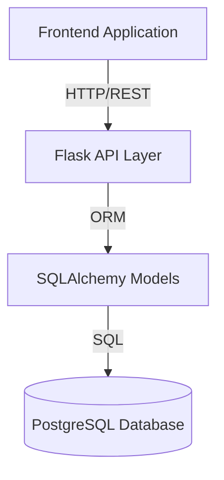
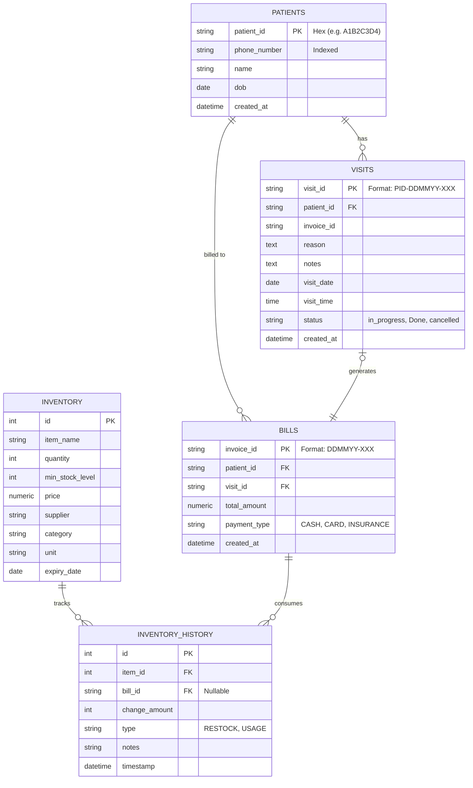
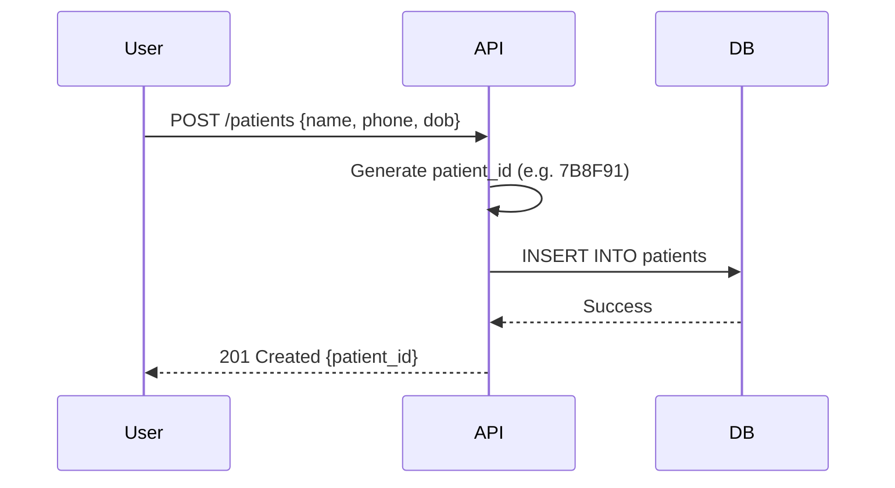
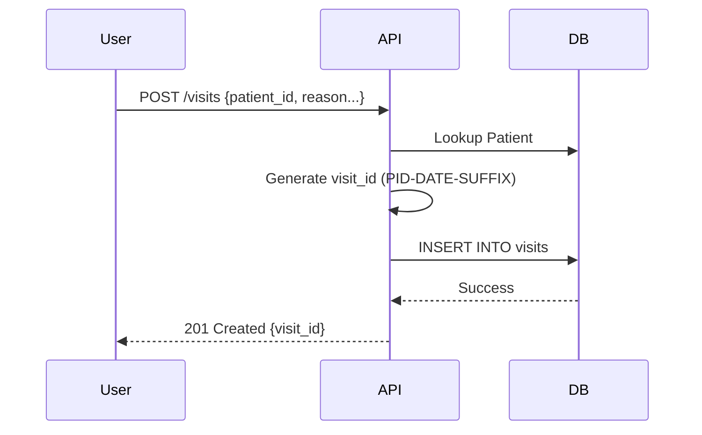
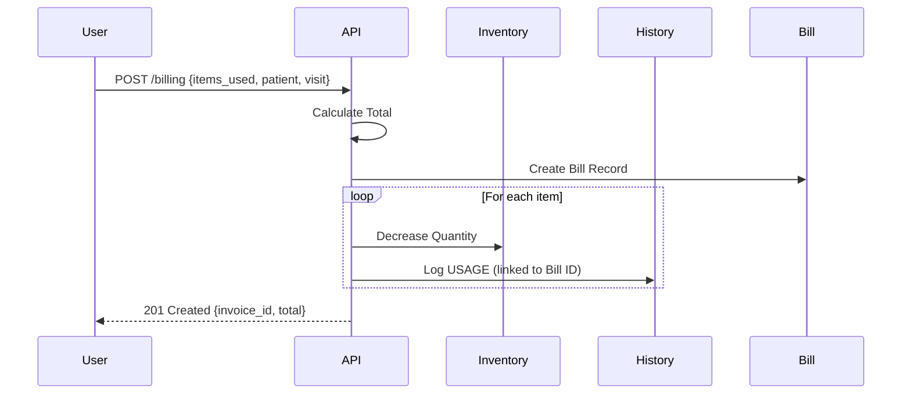

# System Documentation

## 1. System Overview

The **Clinic Management System** is a backend service designed to manage core clinic operations including patient records, visit logging, inventory tracking, and billing. It is built using **Python (Flask)** and **PostgreSQL**, exposing a RESTful API for frontend applications.

### Key Features
- **Patient Management**: Secure storage of patient demographics with unique Hex-based IDs.
- **Visit Logging**: Tracking patient visits with detailed notes, status updates, and prescriptions.
- **Inventory Control**: Real-time stock tracking with history logging for usage and restocking.
- **Billing**: Integrated billing system that links visits and inventory usage to invoices.

### Architecture

## 2. Database Schema

The database consists of 5 main tables. The schema is designed with custom string-based IDs for business entities (Patients, Visits, Bills) to allow for human-readable or secure identifiers.

### ER Diagram

## 3. Data Flow

### 3.1 Patient Registration
When a new patient is registered, the system generates a random 8-character unique Hex ID.

### 3.2 Visit Creation
Visits are linked to patients. The `visit_id` is a composite string containing the patient ID and current date.

### 3.3 Billing & Inventory Usage
Billing is the most complex flow as it involves creating a bill record AND updating inventory stock levels.

## 4. API Reference

### Base URL: `/api`

### Patients
| Method | Endpoint | Description |
|Args|---|---|
| POST | `/patients` | Create a new patient. |
| GET | `/patients` | Search patients by `phone_number` or list all (limit 50). |
| GET | `/patients/<id>` | Get details of a specific patient. |

### Visits
| Method | Endpoint | Description |
|---|---|---|
| POST | `/visits` | Log a new patient visit. |
| GET | `/visits` | Get list of recent visits (global). |
| GET | `/visits/patient/<id>` | Get all visits for a specific patient. |
| GET | `/visits/<id>` | Get details of a specific visit. |
| PATCH | `/visits/<id>` | Update visit status, reason, or notes. |

### Inventory
| Method | Endpoint | Description |
|---|---|---|
| GET | `/inventory` | List all inventory items with status (OK/LOW STOCK). |
| POST | `/inventory` | Add a new item to inventory. |
| POST | `/inventory/restock` | Restock an existing item (updates quantity + history). |

### Billing
| Method | Endpoint | Description |
|---|---|---|
| POST | `/billing` | Create a bill and deduct used inventory. |
| GET | `/billing/patient/<id>` | Get all invoices for a specific patient. |

## 5. Setup & Initialization

The database tables are initialized using `init_tables.py`. The application configuration is handled in `app.py`, which loads database credentials from environment variables (`.env`).
